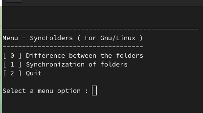

# Sync Folders (Rsync - For Gnu/linux)
## Application to synchronize user folders with external disks and vice versa
---
### Installation & launch
- **Installing PIPENV**  
`pip install pip --upgrade`  
`pip install pipenv`

- **Clone the repository**  
`git clone https://github.com/Mike-mg/Rsync_folders_workstation.git`

- **Go to the Rsync_folders_workstation folder**

- **Creating a working environment and installation of the necessary modules**  
`pipenv install`

- **Activate the work environment**  
`pipenv shell`

- **To disable the working environment**  
`exit`
---
# Running the program
- **Run the program with the following command**  
`python main.py`
####
- **A menu appears, select the desired option  (see below)** 

  
####
- **Menu Options**  
0. Checks the difference between source and destination folders
1. Synchronizes source and destination folders
2. Leave App

